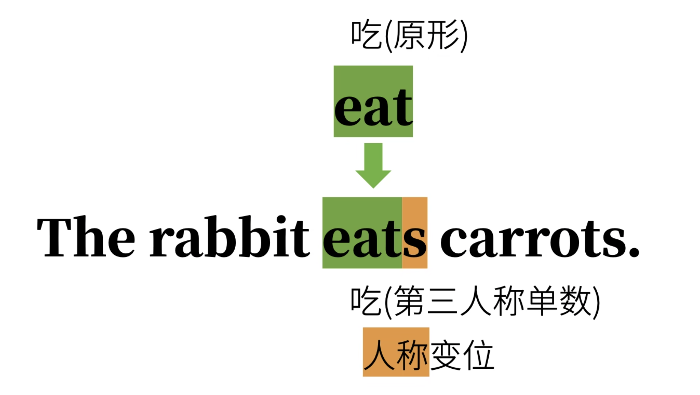
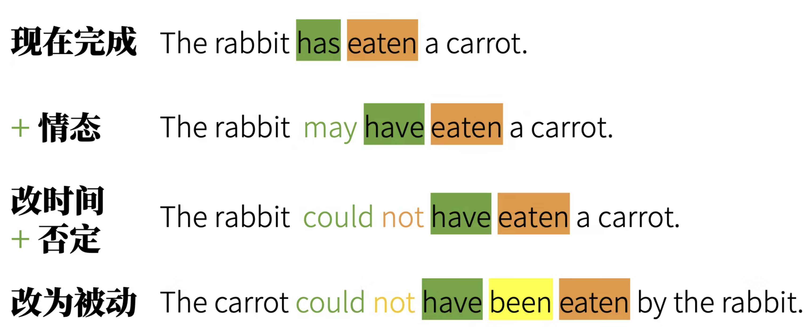
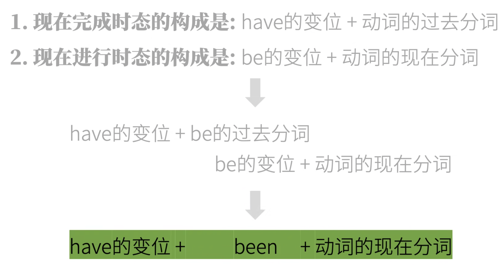

# 动词时态

动词的时态，分为**动词的时间**和**动词的状态**

## 动词时间（4种）

动词时间有：过去、现在、将来、过去将来（对于过去的某一个时间来说是将来）

## 动词状态（4种）

+ 进行状态
+ 完成状态
    + 完成态并不直接说明动作开始的时间
+ 完成进行
    + “这兔子从早上就开始吃萝卜，现在还没停呢。”
    + 言下之意：不但有好多萝卜已经进入了兔子的肚子，这还没完，还有一堆萝卜没吃呢。

+ 一般状态

## 动词时态（理论上有4 * 4 = 16种）

1. 以现在为时间，结合四种状态
    +  现在进行时态 (Present Progressive Tense)
        +  兔子现在正在吃萝卜。
    +  现在完成时态 (Present Perfect Tense)
        +  兔子现在已经吃完了萝卜。
    +  现在完成进行时态 (Present Perfect Progressive Tense)
        +  这兔子已经吃完了一些萝卜，但还要继续吃。
    +  现在一般状态/一般现在时态 (Present Simple Tense/Simple Present Tense)
        +  兔子吃胡萝卜。
2. 以过去为时间，结合四种状态
    + 过去进行时态 (Past Progressive Tense)
        + 这兔子昨天下午3点正在吃萝卜。
    + 过去完成时态 (Past Perfect Tense)
        + 这兔子昨天下午3点吃完萝卜了。
    + 过去完成进行时态 (Past Perfect Progressive Tense)
        + 这兔子昨天下午3点已经吃完了一些萝卜，但是还在吃呢。
    + 过去一般状态/一般过去时态 (Past Simple Tense/Simple Past Tense)
        + 这个兔子过去吃萝卜。
3. 以将来为时间，结合四种状态
    + 将来进行时态 (Future Progressive Tense)
        + 这兔子明天下午3点正在吃萝卜。
    + 将来完成时态 (Future Perfect Tense)
        + 这兔子明天下午3点吃完萝卜了。
    + 将来完成进行时态 (Future Perfect Progressive Tense)
        + 这兔子明天下午3点已经吃完了一些萝卜，但是还要继续吃呢。
    + 将来一般状态/一般将来时态 (Future Simple Tense/Simple Future Tense)
        + 这个兔子将来吃萝卜。
4. 以过去将来为时间，结合四种状态
    + 这个时间结合状态语言解释起来并不容易。可以这样：以一个处于现在的旁观者的身份，观察**一个月前（过去）**一个兔子面对它自己的**将来**时间说的话。这里不在一一举例了。

## 时态的4个难点（知己知彼，百战百胜）

1. 时态混乱，没有正确将时态分成 时 和 态。

2. **动词变位**，单词拼写会因为时态进行改变。

    

3. 时态还需要借助另一种动词，**助动词**，而且助动词也会进行动词变位。

    

4. 时态与其他语法还会结合。

    

## 时态的构成

**现在时间：**

1. 一般 ==现在== 时态：

    1. **动词原形 / 动词原形 + s(第三人称单数)**

        1. 用于表达事实，或者一种习惯

            + I play basketball. 

            + I eat carrots.   这里的萝卜使用复数而且没有加冠词。表示泛指，表达了一种事实“我是吃萝卜的”。
            + I eat a carrots.  这句话语法上没有问题，但是这句话很怪，你是现在去吃萝卜吗？但是又是一般状态。

        2. 表示预计发生的事

            + The bus leaves at 8 PM tonight.
            + 你也可以把他当做一个习惯动作理解 The bus leaves at 8 PM everyday.

2.  ==现在==进行时态：

    1. **助动词be的变位 + 动词的现在分词**
        1. be 主要有两个身份：
            1. 连系动词/系动词 (Linking verbs)。
            2. 助动词，用来构成时态、被动态。
                + I - am
                + she he it - is
                + they we you - are 
        2. 动词的现在分词：
            + 大部分 + ing

3.  ==现在==完成时态：

    1. **助动词have变位 + 动词过去分词**
        1. have主要有两种身份
            1. 实义动词“有”。
            2. 助动词，用来构成时态。
                + I You They We - have
                + She He it - has
        2. 动词过去分词
            + 大部分 + ed

4.  ==现在==完成进行时态：

    1. **have 变位 + been + 动词现在分词** 

        

**过去时间**：

1. 一般 ==过去==时态：
    1.   **大部分 + ed。**
    2. [不规则](www.YingYuTu.com/bgz)
    3. ps : 一般过去和现在完成时态有微妙的区别：
        + 一般过去时态往往强调过去时间节点上的一个事实
        + 现在完成时态往往强调过去事情已经发生对现在的影响
        + 如：I went to Shanghai. 多半是我已经回来了，在原来的某个时间我曾经去过        I have gone to Shanghai. 多半是我现在还在上海呢，你要是有事情找我现在是找不到我的（这句话就不适合当面说，会给母语者一种很奇怪的感觉，你不是在我旁边吗？）
        + 再如：I saw a carrot.  是表达我确实之前在某个地方看到了胡萝卜，没有骗人。  I have seen a carrot. 这句话言下之意为胡萝卜这个东西我是见过的，我知道他的颜色形状的。
2.  ==过去==进行时态：
    1. **助动词be的变位 + 现在分词** 
        + 只不过这个变位不同于现在时间，be过去时间的变位就是过去式的be
        + I/she /he/it  -  was        You/we/they   -   were
3.  ==过去==完成时态：
    1. **助动词have的变位 + 现在分词            have变位这里只有一种，就是had。** 
4. ==过去==完成进行时态：
    1. **have 变位 + been + 动词现在分词           have变位这里只有一种，就是had。**         

**将来时间**：

有人说英语就没有将来时态，有的只是对将来的表达。因为英语中有很多种方式表达将来时间：

下面我们主要讲will做助动词表达将来时间的：（**一般用will 和 shall**）

1. 一般==将来==时态：
    1. **will + 动词原形 （表示说话者对将来发生的事十分确定，如果不确定就要借助“语气”了，后面再说）** 
2. 将来 ==进行==时态：
    1. **将来：will + 动词原形  &  进行： be + 现在分词  -->   将来进行： will  + be + 现在分词 （比一般将来时态还要笃定会发生）** 
3. 将来==完成==时态：
    1. **will  +  have + 过去分词** 
4. 将来==完成进行==时态
    1. **will + have + been + 现在分词** 

**过去将来时间：**

这个时间下使用的时态，往往使用在从句之中（根据主句的过去时间点，从句中说过去的将来）。

1. 一般==过去将来== 时态：
    1. **would + 动词原形**
        + I said I would eat a carrot for lunch.
2.  ==过去将来==进行时态：
    1. **would + be + 现在分词** 
3. ==过去将来==完成时态：
    1. **would + have + 过去分词** 
4. ==过去将来==完成进行：
    1. **would + have + been + 过去分词** 

>  Would这个词除了做过去将来的助动词，也常常在虚拟语气中出现来表达相反的意思。
>
> 如： if I were you, I would eat a carrot.
>
> Would也有更加礼貌的表达意思
>
> 如： Would you pass me the carrot, please?   (比Will you 更礼貌)      Would you like a carrot for lunch?    (比Do you 更礼貌)

到这里我们就讲完了16种时态了！看着很多，其实常用的只有现在时间下的4种，过去时间下的4种，将来时间下的前2种，过去将来基本不用。
