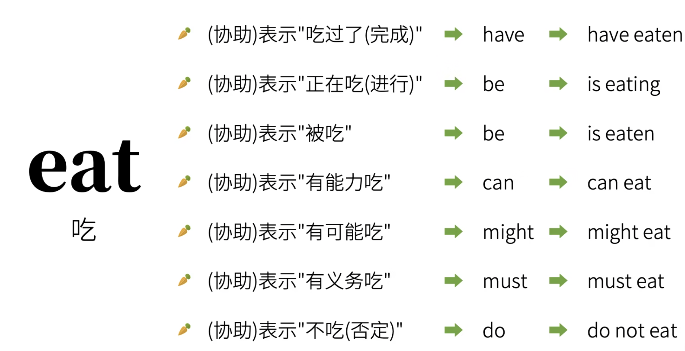

# 英语语法整体框架（以动词为核心的语法体系）

## 动作（动词）

当英语句子被拆分到不能再拆分时，它都是在描述 **什么**(主语 subject) + **怎么样**(谓语 predicate)

1. 可以独立完成的动作
    + 主语 (subject) + 不及物动词 (intransitive verbs)
    + Papa Rabbit sleeps.
2. 有1个动作的承受者
    + 主语 + 单及物动词 (transitive verbs) + 宾语 (object)
    + Papa Rabbit likes you.
3. 有2个动作的承受者
    + 主语 + 双及物动词 + 间接宾语(indirect object) + 直接宾语(direct object)
    + Papa Rabbit teaches you English.  
    + 注意：`English`这里是**直接宾语**，我们可以将句子缩短：Papa Rabbit teaches English. 而`you`才是**间接宾语**。
4. 只有一个动作承受者，但是需要补充。
    + 主语 + 复杂及物动词 + 宾语 + 宾语补语(complement)
    + Papa Rabbit considers you smart.
5. 非动作
    + 主语 + 系动词 + 主语补语/表语
    + Papa Rabbit is tall.  Papa Rabbit is in the room.  Papa Rabbit looks tall.  Papa Rabbit smells tall.
    + 这样将后面的状态、信息赋予给前面的动词，我们成为**连系动词 Linking Verbs**，也称为**系动词**。而系动词后面的补充信息成为补语，这里是主语的补语。主语补语也被称之为**表语 predicative**。

那其实5种不同的谓语，就对应了5种基本句型。

其实严格来讲，谓语动词是谓语的一部分。（句子主语后面余下的一部分就是谓语）

## 句子成分 clause element （8大句子成分）

那么回到句子成分，我们已经介绍了5种：

1. 主语 Subject

2. 谓语动词 Predicate Verb

3. 宾语 Object

4. 宾语补语 Object Complement

5. 主语补语 Subject Complement

   当然还剩下下面的3个，这里补充完成。

6. 定语 Attributive

   + ==The little white== rabbit ate ==a large== carrot.

7. 状语 Adverbial

   + The rabbit ate ==quickly==.

8. 同位语  Appositive （主要用于再把主语说一遍，与主语同等地位）

   + Papa Rabbit, an English teacher, eats carrots.

上面这样无法再做拆分的句子就是**简单句 Simple Sentence**。平时造句会将简单句进行组合，形成**复合句/并列句Component Sentence** 和 **复杂句 Complex Sentence**。

复合句：将简单句进行并列组合。

复杂句：将简单句进行嵌套，是一种复合关系。在英语上，一个句子嵌套另一个句子，分别叫做主句（main clause）和从句（subordinate clause）.

> 上述中的从句，无非是将一个简单句修改一下充当另一个句子的成分。
>
> 比如我们修改一个句子的成分让他充当另一个句子的主语，这就叫**主语从句**。
>
> 比如我们修改一个句子的成分让他充当另一个句子的宾语，这就叫**宾语从句**。
>
> 比如我们修改一个句子的成分让他充当另一个句子的表语，这就叫**表语从句**。
>
> 比如我们修改一个句子的成分让他充当另一个句子的同位语，这就叫**同位语从句**。
>
> ---> 由于以上句子从句具有名词的性质，所以又合称为**名词性从句**。
>
> 当然，我们修改一个句子的成分让他充当另一个句子的定语，这就叫**定语从句**。
>
> 我们修改一个句子的成分让他充当另一个句子的定语，这就叫**状语从句**。

ps: 有些书上，喜欢将Complex Sentence称为复合句，这可能会造成一些误导。如果一定要这样讲，请讲 `component sentence`称为**并列复合句**，将`Complex Sentence`称为**主从复合句**。

## 词类 parts of speech （10大词类）

1. 动词 verbs 说过了
2. 名词 nouns 
   + 表示人和物
   + Papa Rabbit is a ==rabbit==.
3. 冠词 articles
   + 说明人和物
   + Papa Rabbit is ==a== rabbit.
4. 代词 pronouns
   + 替代人和物
   + ==I== am a rabbit.
5. 形容词 adjectives
   + 形容人和物
   + I am a ==smart== rabbit.
6. 数词 numerals
   + 表示数量
   + I have ==two== carrots.
7. 副词 adverbs
   + 修饰动词和形容词
   + I ate two carrots ==quickly==.
8. 介词 prepositions
   + 表示和其他词关系的词
   + I ate two carrots ==with== chopsticks.
9. 叹词 interjections
   + 表示感叹
   + ==Ah==, the carrot is tasty! 
10. 连词 conjunction
    + 连接词和句
    + I ate two carrots and a potato, ==because== I was hungry.

## 谓语动词的“三大本领” TAM 

1. 表示动作==时==间  -- Tense
   + 现在、过去、将来、过去将来

2. 表示动作状==态==  -- Aspect

   + 一般、完成、进行、完成进行
   + ps： ==时态==不仅仅代表时间，也代表状态，理论上来讲时态一共有4 * 4 = 16种

3. 动作假设、情感...  -- Mood

   + 这个叫做动词的语气

   + 此“语气”非彼“语气”，这里是语法中的语气。

     > If I were a rabbit...
     > （虚拟语气）
     > I ate a carrot and...
     > （陈述语气）
     > Eat this carrotand...
     > （祈使语气）

## 助动词

但是其实谓语动词本身不能够独立表现本领，而且也无法单独表现出否定性、可能性、必须性等意思。所以就必须借助经常和谓语动词联动的词——**助动词 Auxiliary Verbs**

但是请注意，助动词（没有实义，只是帮助谓语动词）有时候可以做实义动词甚至其他词性。比如have可以表示拥有，might可以表示力量，can可以表示易拉罐，be可以表示时态

## 非谓语动词

动词可以充当句子中的许多成分！比如谓语（动词），还可以充当主语、宾语、宾语补语、主语补语、定语......，这些都是非谓语动词。而且非谓语动词**几乎可以替代所有从句**从而简化句子。只不过这样的动词，不在具备状态、语态、语气的功能，也就是他们丧失了时态语态语气的本领。

他们是以不同的形式出现句子中,

但是也有个麻烦事：

动词不定式和谓语动词原形一样

现在分词、动名词和谓语动词进行状态一样

过去分词和谓语动词完成状态一样

**如果不告诉你上下文，你是无法判断这个动词到底是干嘛的。**

