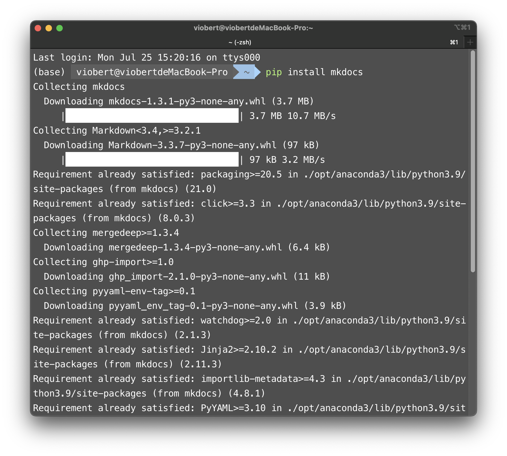

# Getting Started


## Github Pages

你想拥有一个自己的个人博客、网站吗，那么gh pages是一个不二选择。你不必拥有自己的服务器、自己申请域名什么什么的，因为GitHub都帮你把麻烦事解决了！

## Introduction

使用GitHub pages制作自己的**静态**网站有许许多多的途径。[GitHub Pages](https://pages.github.com/)为你提供一个舞台，舞台上的你可以尽情表演自己的才能，像[jekyll](https://jekyllrb.com/)、[hexo](https://hexo.io/zh-cn/)、[mkdocs](https://www.mkdocs.org/)......都可以帮你快速高效的搭建一个静态网站。这里博主选择的是mkdocs（其他的我也没试过哈哈，先看到了mkdocs的教程了）。

我个人的电脑环境是 macOS Monterey 12.2.1。不同的环境也可以稍作借鉴啦，不同的地方碰到疑惑需要自己google去找解决的方案，这才是一种学习的过程！

## Install git

什么，你还没学会git？其实也不要紧，你可以去上一篇博客[learn git](https://viobert.github.io/self_impro/GIT/learnGit/git/)看看吧。不用学会很多，你也可以先读下面，不会再查。

## Install mkdocs

[mkdocs installation--A detailed guide ](https://www.mkdocs.org/user-guide/installation/)

> MkDocs requires a recent version of [Python](https://www.python.org/) and the Python package manager, [pip](https://pip.readthedocs.io/en/stable/installing/), to be installed on your system.
>
> You can check if you already have these installed from the command line:

```
$ python --version
Python 3.8.2
$ pip --version
pip 20.0.2 from /usr/local/lib/python3.8/site-packages/pip (python 3.8)
```

mkdocs需要Python和pip，所以你需要先安装Python。你可以在命令行中输入上面的代码检验一下你是否已经安装过了。Python、pip的安装这里就先不记录了。

那么到这里我可以认为你已经拥有了上述条件，那么很简单，命令行中输入

```
$ pip install mkdocs
```

> You should now have the `mkdocs` command installed on your system. Run `mkdocs --version` to check that everything worked okay.

安装完成后可以命令行输入如下，进行检查。

```
$ mkdocs --version
mkdocs, version 1.2.0 from /usr/local/lib/python3.8/site-packages/mkdocs (Python 3.8)
```



## Install mkdocs-material

