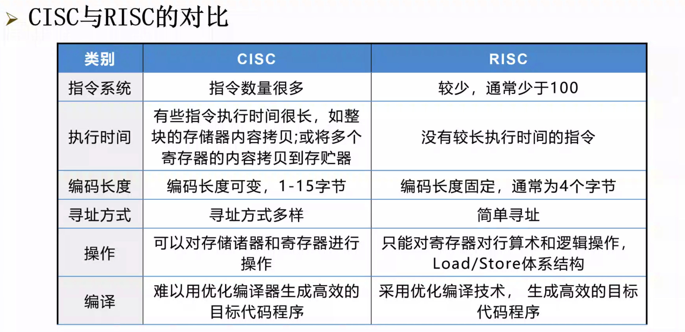
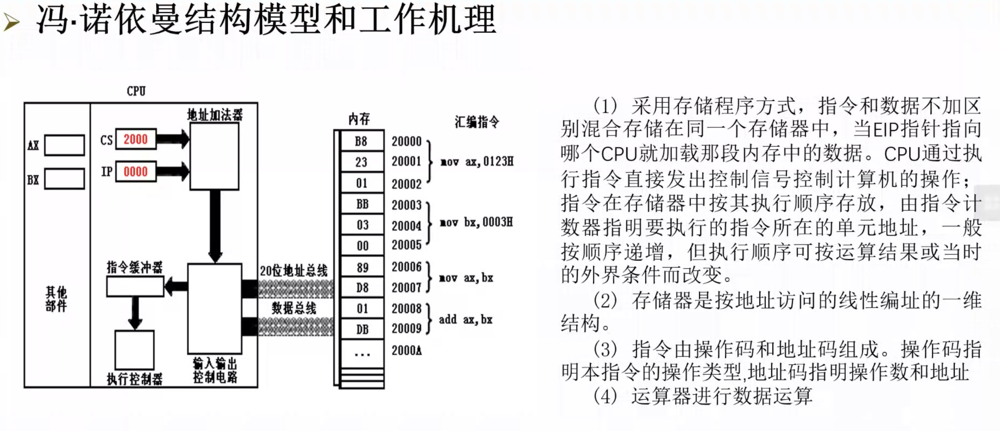
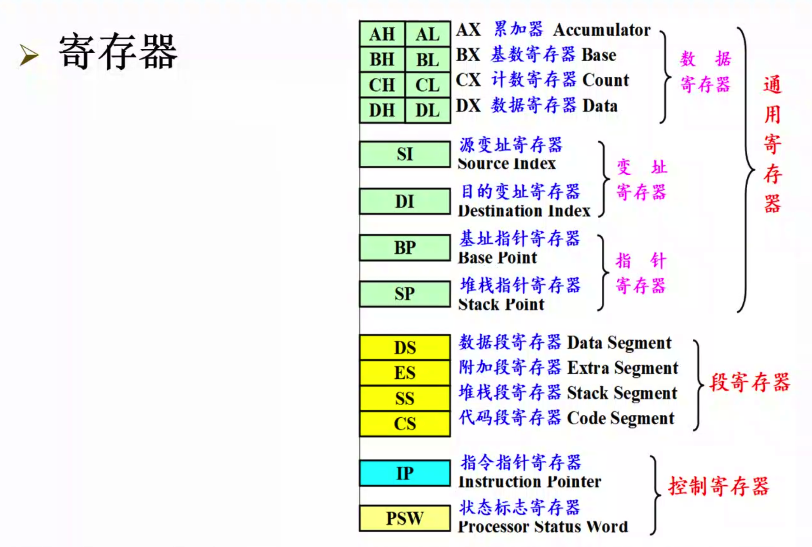

# 汇编语言

## 第一章 

### 复杂指令集和简单指令集

**CISC:复杂指令集(Complex Instruction Set Computer)，其特点如下：**

+ 具有大量的指令和寻址方式，指令长度可变
+ 8/2原则：80%的程序只使用20%的指今
+ 大多数程序只使用少量的指令就能够运行。

**RISC:精简指令集(Reduced Instruction Set Computer0，其特点如下：**

+ 只包含最有用的指令，指令长度固定
+ 确保数据通道快速执行每一条指令
+ 使CPU硬件结构设计变得更为简单

**CISC的背景和特点**

+ 背景：存储资源紧缺，强调编译优化。
+ 增强指令功能，设置一些功能复杂的指令，把一些原来由软件实现的、常用的功能改
  用硬件的（微程序）指令系统来实现。
+ 为节省存储空间。强调高代码密度。指令格式不固定，指令可长可短，操作数可多
  可少。
+ 寻址方式复杂多样。操作数可来自寄存器，也可来自存储器。
+ 采用微程序控制。执行每条指令均需完成一个微指令序列。
+ CPI>5，指令越复杂，CPI越大。

**RISC的基本设计思想**

+ 减小CPI:CPUtime = Instr Count * CPI * Clock cycle.

+ 精简指令集:保留最基本的，去掉复杂、使用频度不高的指令。

+ 采用Load/Store结构，有助于减少指令格式，统一存诸器访问方式。==采用硬接线控制代替微程序控制== 。

+ 采用RISC指令集可以减少指令平均执行周期数（RISC 大多数指令在一个时钟周期内完成）

  > 

**RISC 与 CISC的对比**

重要的图

CPU寄存器结构 占10分的图

