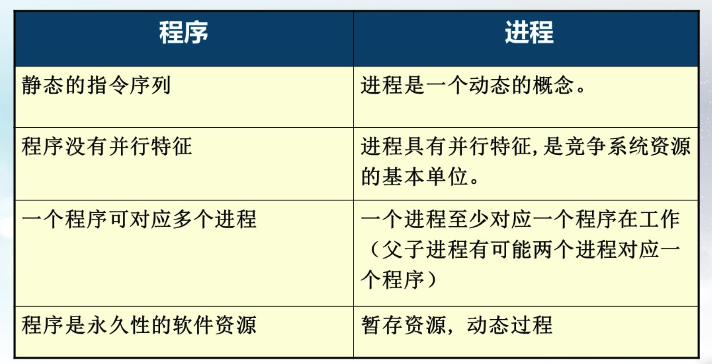

# 操作系统

## 第一章 操作系统引论

### 1.1 操作系统的目标和作用

+ 通常在计算机硬件上配置的OS，主要有以下目标：

    1. 有效性：资源利用率，系统吞吐量
    2. 方便性：程序的使用方式
    3. 可扩充性：新功能的添加
    4. 开放性：兼容性

+ ① OS作为用户与计算机硬件系统之间的接口。os 处于用户与计算机硬件系统之间。

+ 注意：OS是一个系统软件，因而这种接口是 ==软件接口==。

+ 操作系统控制方式：

    1. 命令方式。
    2. 系统调用方式。
    3. 图形、窗口方式。

+ ② OS作为计算机系统资源的管理者

  归纳起来可将资源分为四类：处理器、存储器、1/0设备以及信息(数据和程序)。相应地，OS的主要功能也正是针对这四类资源进行有效的管理，即：

    1. **处理机管理**，用于分配和控制处理机；
    2. **存储器管理**，主要负责内存的分配与回收：
    3. **I/0设备管理**，负责I/0设备的分配与操纵；
    4. **文件管理**，负责文件的存取、共享和保护。

+ ③ OS实现了对计算机资源的抽象

+ 如果我们在裸机上覆盖一层**I/0设备管理软件**，用户便可利用它所提供的1/0命令，来进行数据输入和打印输出。**通常把覆盖了软件的机器称为扩充机器或** ==虚机器==。

### 1.2 操作系统发展历程

无操作系统的计算机系统（人工、脱机输入输出） --  批处理系统（单道、多道批处理系统） --  分时系统  --  实时系统  --  通用操作系统

+ 多道程序设计的优点:
  1. 提高CPU的利用率。
  2. 可提高内存和I/O设备利用率。
  3. 增加系统吞吐量。
+ 多道批处理系统的优缺点:
  1. 资源利用率高：程序交替执行
  2. 系统吞吐量大：忙碌时间长
  3. 平均周转时间长：排队处理 （平均周转周期是指内存中一个作业从开始到结束，因为多道批处理时，一个作业结束未必能及时占用CPU，可能还在处理其他作业）
  4. 无交互能力：无法中断
+ 实时系统(Real-Time System)是指系统能及时(或即时)响应外部事件的请求，**在规定的时间内**完成对该事件的处理，并控制所有实时任务协调一致地运行。

### 1.3 操作系统基本特性

#### 1.3.1并发性

注意：**并行性**是指两个或多个事件在**同一时刻**发生。 **并发性**是指两个或多个事件在**同一时间间隔内**发生。

+ 单处理器多道批处理环境下：
    + 多道：内存中同时存放几个作业；
    + 宏观上并行运行：都处于运行状态，但都未运行完；
    + 微观上串行运行：各作业交替使用CPU。（看似都在运行，其实都在等待一个CPU进行处理）
+ 多个处理机环境下：
    + 可以并发执行的程序便可被分配到多个处理机上，实现并行执行。

#### 1.3.2 共享

在操作系统环境下，所谓共享是指系统中的**资源**可供内存中**多个并发执行的进程(线程)共同使用**。由于资源属性的不同，进程对资源共享的方式也不同，目前主要有以下两种资源共享方式。
1. 互斥共享方式：学校的打印机等（别人在打印时，你只可以提交作业但是不能打印）
2. 同时访问方式（宏观意义上）：磁盘

+ 并发和共享是操作系统的两个最基本的特征，它们又是互为存在的条件。
+ 资源共享是以程序(进程)的并发执行为条件的，若系统不允许程序并发执行，自然不需要资源共享；
+ 若系统不能对资源共享实施有效管理，协调好诸进程对共享资源的访问，也必然影响到程序并发执行的程度，甚至根本无法并发执行。

#### 1.3.3 虚拟

操作系统中的所谓“虚拟〞，是指通过某种技术**把一个物理实体变为若干个逻辑上的对应物**。物理实体(前者)是实的，即实际存在的；而后者是虚的，是用户感觉上的东西。用于实现虚拟的技术，称为虚拟技术。操作系统中利用两种方式实现虚拟技术：

1.  时分复用技术
2. 空分复用技术

#### 1.3.4 异步性

+ 由于资源等因素的限制，使进程的执行通常都不是〞一气呵成〞而是以“停停走走〞的方式运行。
+ 进程是以人们不可预知的速度向前推进，此即进程的异步性。
+ 异步运行方式是允许的，是操作系统的一个重要特征。

### 1.4 操作系统的主要功能

处理机管理功能

存储器管理功能

设备管理功能

文件管理功能

### 1.5 操作系统的结构设计

1. 无结构操作系统
    + 以追求功能实现和高效率，os内部没有任何结构
2. 模块化操作系统
    + 分解、模块化的原则
    + 每个模块具有某些方面的功能，如：进程管理模块、存储器管理模块、I/0设备管理模块和文件管理模块等
3. 分层操作系统
    + 分层式结构设计的基本原则是：每一层都仅使用其底层所提供的功能和服务，这样可使系统的调试和验证都变得容易，因为它与所有其高层的软件无关，而任意层以下的各层软件，又都经过仔细的调试。
    + 层次的设计：
        + 程序嵌套
        + 运行效率
        + 公用模块
        + 程序接口
4. 微内核os结构（现在使用的）
    1. 客户/服务器模式(Client-Server Model)的组成
        + 客户机：运行客户进程，发消息给服务器服务器；
        + 为客户提供服务，被动的接收请求网络系统；
        + 连接客户机和服务器，实现通信过程。

## 第二章 进程管理

### 2.1 进程的基本概念

前趋图(Precedence Graph)是一个有向无循环图，用于描述进程之间执行的前后关系。

程序顺序执行的特征：

+ 顺序性
+ 封闭性
+ 可再现性

程序并发性的特征：

+ 间断性：可能因等待某个任务结束而需要暂停
+ 失去封闭性：系统资源的状态受多个并发程序影响
+ 不可再现性：并发环境下，复现结果很难

进程的特征

+ 结构特征(PCB)：描述进程的基本情况和活动过程
+ 动态性：程序的一次执行过程，**最基本特征** 
+ 并发性：多个进程同时运行 
+ 独立性：独立运行、分配资源和调度
+ 异步性：不可知的速度向前推进

进程的定义：

+ 进程是程序的一次执行。
+ 进程是一个程序及其数据在处理机上顺序执行时所发生的
    活动。
+ 进程是程序在一个数据集合上运行的过程，它是系统进行资源分配和调度的一个独立单位。
+ 进程实体：由程序段、相关数据和PCB组成在引入了进程实体的概念后，我们可以把传统OS中的进程定义为：**“进程是进程实体的运行过程，是系统进行资源分配和调度的一个独立单位”** 

程序和进程的区别：

进程控制块:

+ OS是根据PCB来对并发执行的进程进行控制和管理的。**进程控制块是系统感知进程的唯一实体，或者说PCB是进程存在的唯一标志。**
+ 进程控制块的两种组织方式：
    + 链接方式
    + 索引控制

### 2.2 进程控制

+ 进程控制：系统使用一些具有特定功能的 **程序段（原语）**来创建、撤销进程以及完成进程各状态间的转换，从而达到多进程高效率并发执行和协调实现资源共享的目的。

+ 原语：在**系统态** 下执行的具有特定功能的**程序段** ，原语分为指令级原语和功能级原语。
    + 指令级原语：执行期间不允许中断，是不可分割的单位。
    + 功能级原语：执行期间不允许并发的程序段。
+ 原语操作：即原子操作，一个操作中的所有动作要么全做，要么全不做。
+ 原语的特点：
    + 具有独立的系统功能：
    + 在系统态运行；
    + 不允许中断或不允许并发。

+ 进程的基本状态：

    + 就绪状态
    + 执行状态
    + 阻塞状态

+ 加入挂起状态后：

    

### 2.3 进程的同步与互斥

