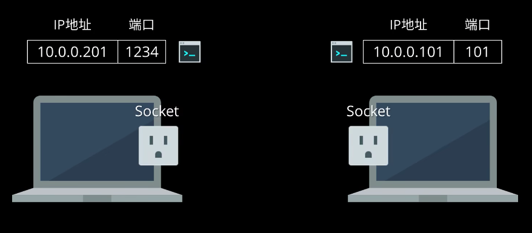
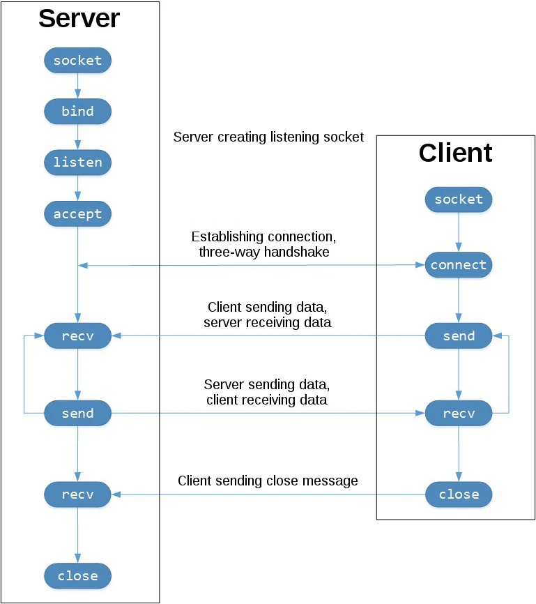

# Socket (Python)

>Sockets and the socket API are used to send messages across a network. They provide a form of [inter-process communication (IPC)](https://en.wikipedia.org/wiki/Inter-process_communication). The network can be a logical, local network to the computer, or one that’s physically connected to an external network, with its own connections to other networks. The obvious example is the Internet, which you connect to via your ISP.

socket 有不少应用：

+ [Network socket](https://en.wikipedia.org/wiki/Network_socket), an end-point in a communication across a network or the Internet
+ [Unix domain socket](https://en.wikipedia.org/wiki/Unix_domain_socket), an end-point in local inter-process communication
+ `socket()`, a system call defined by the [Berkeley sockets](https://en.wikipedia.org/wiki/Berkeley_sockets) API
+ [CPU socket](https://en.wikipedia.org/wiki/CPU_socket), the connector on a computer's motherboard for the CPU

我们这里主要记录Internet Socket，简单来说就是用于不同主机通信的一个接口，有一个很形象的比喻：你可以把他想象成插座，用来连接数据线（传输数据）。



本次学习主要内容：

+ 一个简单的**套接字服务器和客户端**
+ 同时处理**多个连接的改进版本**
+ 一个服务器-客户端应用程序，其功能类似于一个成熟的**套接字应用程序**，具有自己的**自定义标头和内容**


## TCP Socket

创建一个套接字对象`socket.socket()`，并将套接字类型指定为`socket.SOCK_STREAM`。当您这样做时，使用的默认协议是[传输控制协议 (TCP)](https://en.wikipedia.org/wiki/Transmission_Control_Protocol)。这是一个很好的默认值，可能是您想要的。

Why should you use TCP? The Transmission Control Protocol (TCP):

+ **Is reliable:** Packets dropped in the network are detected and retransmitted by the sender.
+ **Has in-order data delivery:** Data is read by your application in the order it was written by the sender.

相比之下，使用创建的[用户数据报协议 (UDP)](https://en.wikipedia.org/wiki/User_Datagram_Protocol)套接字`socket.SOCK_DGRAM`不可靠，并且接收方读取的数据可能与发送方的写入乱序。

TCP 的套接字 API 调用和数据流的顺序：




## Echo Server

An echo server is a server that replicates the request sent by the client and sends it back.

```python
# echo-server.py

import socket

HOST = "127.0.0.1"  # Standard loopback interface address (localhost)
PORT = 65432  # Port to listen on (non-privileged ports are > 1023)

with socket.socket(socket.AF_INET, socket.SOCK_STREAM) as s: # 使用 with 语句就无需在结束时调用 s.close() 了
    s.bind((HOST, PORT))
    s.listen()
    conn, addr = s.accept()
    with conn:
        print(f"Connected by {addr}")
        while True:
            data = conn.recv(1024)
            if not data:
                break
            conn.sendall(data)
            
   
```


------------

### 小插曲 Standard loopback interface address (localhost) ?

计算机网络学过去一阵了，应该当初有些地方没学好，这里补一下吧：

1. IP地址：IP地址可以这样分：

   + A类地址：网络号占1个字节。网络号的第一位固定为0。
   + B类地址：网络号占2个字节。网络号的前两位固定为10。
   + C类地址：网络号占3个字节。网络号的前三位固定位110。
   + D类地址：前四位是1110，用于多播(multicast)，即一对多通信。
   + E类地址：前四位是1111，保留为以后使用。

2. IP地址也有公网（公网与Internet相连）和内网之分

   + 公有IP地址

     一般称公网中的**IP地址**为公有地址。公有地址由Inter NIC（因特网信息中心）负责，这些**IP地址**分配给**注册**并向Inter NIC提出申请的组织机构。公有地址是全球唯一的，公网中不可能存在两个相同的**IP地址**。**范围**：除了私有地址以外的地址，都属于公有地址。

   + 私有IP地址

     一般称内网（即局域网）中的**IP地址**为私有地址。私有地址是**非注册地址**，用于组织机构内部使用。私有地址的范围如下：

     + A类IP地址中：10.0.0.0--10.255.255.255
     + B类IP地址中：172.16.0.0--172.31.255.255
     + C类IP地址中：192.168.0.0--192.168.255.255

     私有地址与公有地址不同，并不是由**Internet**分配的，是不允许出现在**Internet**中的，我们在公网中是看不到**私有IP地址**的，并且公有地址也不会使用上述的三类地址。所以，私有地址是不能直接与**Internet**连接的。

     而如果想用私有地址与Internet连接来访问公网，那该怎么做？这就需要将**私有IP地址**转换成**公网IP地址**，与外部连接。所以，我们平时使用的路由器中会装有一个叫做 **NAT（网络地址转换）** 的软件，我们的路由器中会至少会有一个有效的**公网IP**，**NAT**会将我们的**私有地址**转成路由器中的**公网IP**与外部Internet连接。而同样的，因为使用的是路由器中的**公共的公网IP**来连接Internet，所以这个内网中的PC在Internet中显示的都是路由器的**公共IP**，这样做不仅提供了一定程度的安全，也可以有效的减缓可用的IP地址空间的枯竭问题。（像我们学校或者公司的内网一般都是这么做的）

     另外还有一点，在同一个局域网内，IP地址是唯一的；但是在不同的局域网内，IP地址是可以重复出现的。

     >**Tips：** 在**局域网A**中，有个主机的**IP地址**是`192.168.10.128`，那么绝不可能在**局域网A**中还有其他主机的**IP地址**为`192.168.10.128`。但是在**局域网B**中却可以有主机的**IP地址**也是`192.168.10.128`。
     > 如果**局域网A**中的`192.168.10.128`**主机**与**局域网B**中的`192.168.10.128`**主机**通信，不会冲突吗？不会，因为上述说过，它们最终都是使用路由器中的`公网IP`来连接外网的，而`公网IP`是全球唯一的。

3. Localhost、127.0.0.1、0.0.0.0分别是什么？

   + localhost 是一个域名（DNS解析），它默认指向了IP地址为`127.0.0.1`。当然你也可以手动进行修改。

   + `127.0.0.1` 是一个回环地址（loop back address），以127开头的IP地址，都是回环地址。其所在的回环接口一般被理解为虚拟网卡，并不是真正的路由器接口。一般电脑上的网卡，可以理解为三种：1--loopback（这是一块虚拟网卡）；2--ethernet （这是你的有线网卡）； 3--wlan（这是你的无线网卡）。你的本机 IP 是你真实网卡的 IP，具体来说有线无线各有一个，而 `127.0.0.1` 是那块叫做 loopback 的虚拟网卡的 IP。无论什么程序使用loopback address发送数据都将会立刻返回，不进行网络传输。loopback address 一般用来测试本机TCP/IP实现是否正常。

   + `0.0.0.0` 也是一个特殊地址，`0.0.0.0`是不能被`ping`通的。在服务器中，`0.0.0.0`并不是一个真实的的**IP地址**，它表示本机中所有的**IPV4地址**。监听`0.0.0.0`的端口，就是监听本机中所有**IP**的端口。

     > **Tips：**为了讲清楚本机IP地址、127.0.0.1和0.0.0.0三者的区别。下面举例说明，先假设pc1(server+client)有两个网卡： 192.168.0.1 ， 10.10.152.8 。pc2只是client。
     >
     > pc1(server)只监听 127.0.0.1 ，pc1(client)能连上 127.0.0.1 和 0.0.0.0 （ 192.168.0.1 和 10.10.152.8 连不上）；pc2连不上pc1的任何地址（ 192.168.0.1 或者 10.10.152.8 ）；
     > pc1(server)只监听 192.168.0.1 ，pc1(client)能连上 192.168.0.1 和 0.0.0.0 （ 127.0.0.1 和 10.10.152.8 连不上）；pc2能连上pc1的 192.168.0.1 （ 10.10.152.8 连不上）；（只监听 192.168.0.1与此例类似）
     > pc1(server)监听 192.168.0.1 和 10.10.152.8 ，pc1(client)能连上 192.168.0.1 、 10.10.152.8 和 0.0.0.0 （ 127.0.0.1 连不上）；pc2都能连上pc1的（包括 10.10.152.8 和 192.168.0.1 ）；
     > pc1(server)只监听 0.0.0.0 ，pc1(client)都能连上（包括 10.10.152.8 、 0.0.0.0 、 127.0.0.1 和 192.168.0.1 ）；pc2都能连上pc1的（包括 10.10.152.8 和 192.168.0.1 ）；
     > ————————————————
     >
     > 对于只进行单机测试，一般只需要监听 127.0.0.1 。
     >
     > 对于多机测试，可监听所有ip 0.0.0.0 或者只监听某个或某几个具体的ip。对于多机连接，监听127.0.0.1 无效，监听 0.0.0.0 就没有了屏蔽其他ip的功能。

4. 特殊的IP地址

   |         地址          |                             用途                             |
   | :-------------------: | :----------------------------------------------------------: |
   |         {0,0}         | 网络号和主机号都全部为0，表示“本网络上的本主机”，只能用作源地址。 |
   |     {0，host-id}      |              本网络上的某台主机。只能用作源地址              |
   |        {-1,-1}        | 表示网络号和主机号的所有位上都是1（二进制），用于本网络上的广播，只能用作目的地址，发到该地址的数据包不能转发到源地址所在网络之外。 |
   |      {net-id,-1}      |          直接广播到指定的网络上。只能用作目的地址。          |
   | {net-id,subnet-id,-1} |      直接广播到指定网络的指定子网络上。只用作目的地址。      |
   |    {net-id,-1,-1}     |     直接广播到指定网络的所有子网络上。只能用作目的地址。     |
   |        {127，}        | 即网络号为127的任意ip地址。都是内部主机回环地址(loopback)，永远都不能出现在主机外部的网络中。 |

-----------

   

```python
# echo-server.py

# ...

with socket.socket(socket.AF_INET, socket.SOCK_STREAM) as s:
    s.bind((HOST, PORT))
    # ...
```

`.bind()`方法用于将套接字与特定的网络接口和端口号相关联：

传递`.bind()`的值取决于套接字的[地址族](https://realpython.com/python-sockets/#socket-address-families)。在此示例中，您使用的是`socket.AF_INET`(代表IPv4)。所以它需要一个二元组：`(host, port)`.

`host`可以是主机名、[IP 地址](https://realpython.com/python-ipaddress-module/)或空字符串。如果使用 IP 地址，则`host`应该是 IPv4 格式的地址字符串。IP 地址`127.0.0.1`是[环回](https://en.wikipedia.org/wiki/Localhost)接口的标准 IPv4 地址，因此只有主机上的进程才能连接到服务器。如果您传递一个空字符串，服务器将接受所有可用 IPv4 接口上的连接。

`port`表示接受来自客户端的连接的[TCP 端口号。](https://en.wikipedia.org/wiki/Transmission_Control_Protocol#TCP_ports)它应该是一个从`1`到`65535`，`0`是保留的。如果端口号小于`1024` ，某些系统可能需要超级用户权限。


```python
# echo-server.py

# ...

with socket.socket(socket.AF_INET, socket.SOCK_STREAM) as s:
    s.bind((HOST, PORT))
    s.listen()
    conn, addr = s.accept()
    # ...
```

> The [`.listen()`](https://docs.python.org/3/library/socket.html#socket.socket.listen) method has a `backlog` parameter. It specifies the number of unaccepted connections that the system will allow before refusing new connections. Starting in Python 3.5, it’s optional. If not specified, a default `backlog` value is chosen.
>
> If your server receives a lot of connection requests simultaneously, increasing the `backlog` value may help by setting the maximum length of the queue for pending connections. The maximum value is system dependent. For example, on Linux, see [`/proc/sys/net/core/somaxconn`](https://serverfault.com/questions/518862/will-increasing-net-core-somaxconn-make-a-difference/519152).

## Echo Client

```python
# echo-client.py

import socket

HOST = "127.0.0.1"  # The server's hostname or IP address
PORT = 65432  # The port used by the server

with socket.socket(socket.AF_INET, socket.SOCK_STREAM) as s:
    s.connect((HOST, PORT))
    s.sendall(b"Hello, world")
    data = s.recv(1024)

print(f"Received {data!r}")
```


## Handling Multiple Connections

按照上面的流程仍然存在不足，那就是客户端和服务器端都只能进行一次数据传送然后退出。除此之外，还存在一个问题：`.recv()`存在传输大小上的限制。

```python
data = s.recv(1024)
```

上面的`bufsize`参数表示了最大接受数据长度是`1024`字节。

The `.send()` method also behaves this way. It returns the number of bytes sent, which may be less than the size of the data passed in. You’re responsible for checking this and calling `.send()` as many times as needed to send all of the data:

> “Applications are responsible for checking that all data has been sent; if only some of the data was transmitted, the application needs to attempt delivery of the remaining data.” [(Source)](https://docs.python.org/3/library/socket.html#socket.socket.send)

In the example above, you avoided having to do this by using `.sendall()`:

> “Unlike send(), this method continues to send data from bytes until either all data has been sent or an error occurs. `None` is returned on success.” [(Source)](https://docs.python.org/3/library/socket.html#socket.socket.sendall)

目前可公开问题：

1. 如何并发处理多个连接。
2. 你需要不停调用`.send()`和`.recv()`直到所有数据都已经被接收到了。


## Reference

[IP地址补1](https://blog.csdn.net/ggq89/article/details/80336717)

[IP地址补2](https://zhuanlan.zhihu.com/p/72988255)

[IP地址补3](https://www.jianshu.com/p/ad7cd1d5be45)

[socket+python](https://realpython.com/python-sockets/)